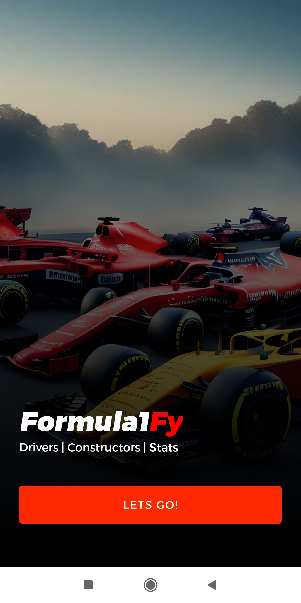
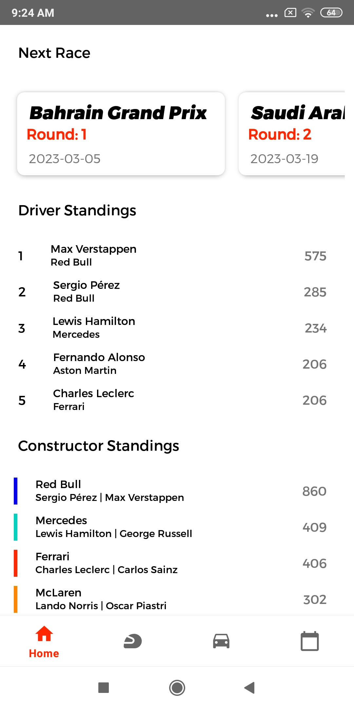
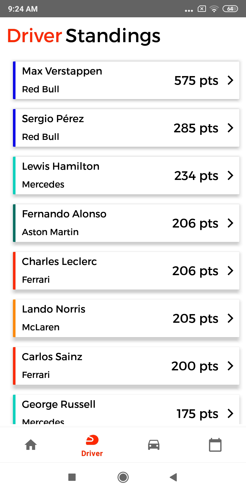
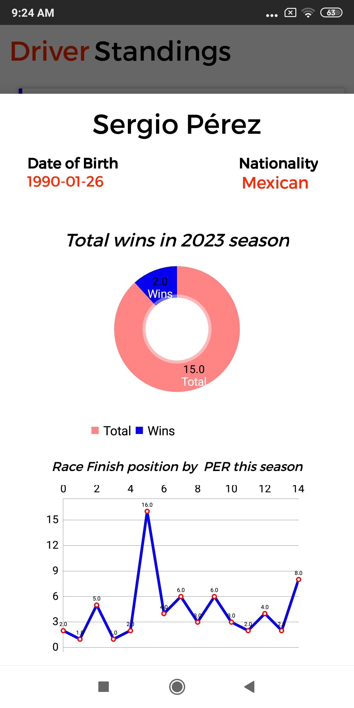
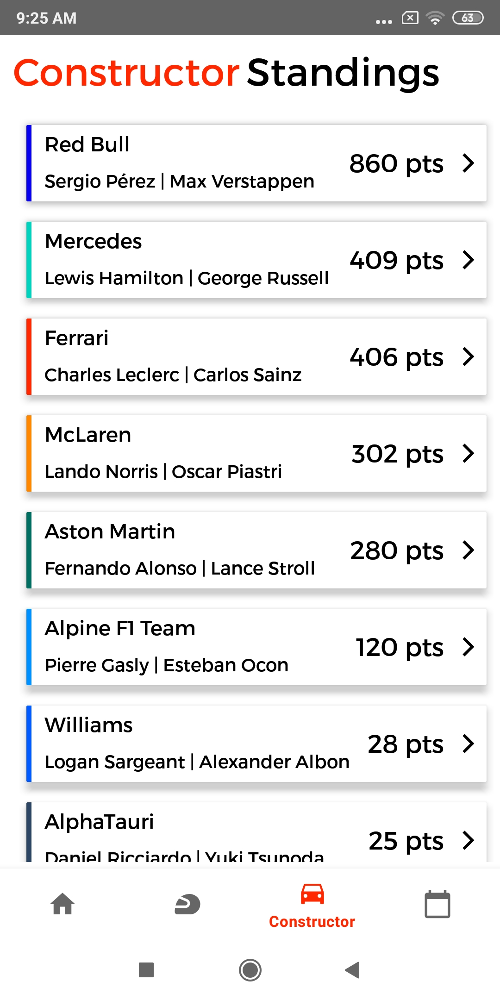
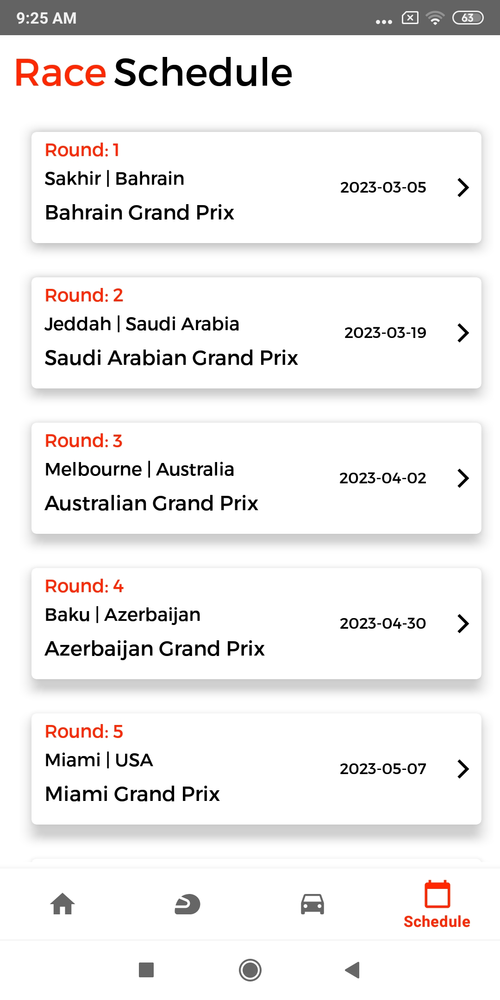

# Formula1Fy

## Description
The Formula1 Stats App is a dedicated application for Formula 1 fans, providing comprehensive information on the current race driver standings, total points scored, constructor standings, individual driver stats, and the upcoming race schedule.

## Screenshots

  
   
  
  
  
   

## Features

- **Driver Standings:** Stay updated with the latest race driver standings, showing the positions and points scored by each driver.

- **Total Points:** Get an overview of the total points scored by each driver throughout the Formula 1 season.

- **Constructor Standings:** Explore the standings of the constructors, showcasing team performances.

- **Individual Driver Stats:** Dive into detailed statistics for each individual driver, including race wins, podium finishes, and other key metrics.

- **Race Schedule:** Access the complete schedule of upcoming Formula 1 races, ensuring you never miss an event.

### Android
1. Download the APK from the [Release Section](https://github.com/Sd023/Formula1Fy/releases/tag/release).
2. Enable "Install from Unknown Sources" in your device settings.
3. Open the APK file on your Android device and follow the on-screen instructions to install.

## Usage

Explore the app's features and enjoy up-to-date Formula 1 statistics and schedules.

## Contributing

This is Project - repo does not allow further contributions as the Ergast API is planning to shutdown at the end of this year [Ergast API](https://ergast.com/mrd/).

## Credits
- Formula 1 API: [Ergast API](https://ergast.com/mrd/)
- Formula 1

## License
This app is licensed under the [Your License Name]. See the [LICENSE](https://github.com/Sd023/Formula1Fy/blob/Formula1Fy_Release/LICENSE) file for details.

## Contact
For any questions, feedback, or support, feel free to reach out to [me](dhanushsd902@gmail.com).

## Acknowledgments

- Special thanks to the Formula 1 community for their passion and support.
